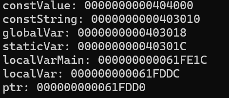
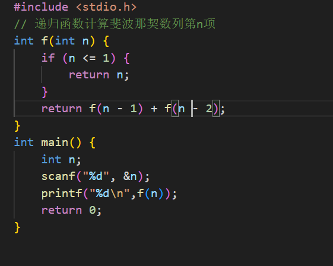
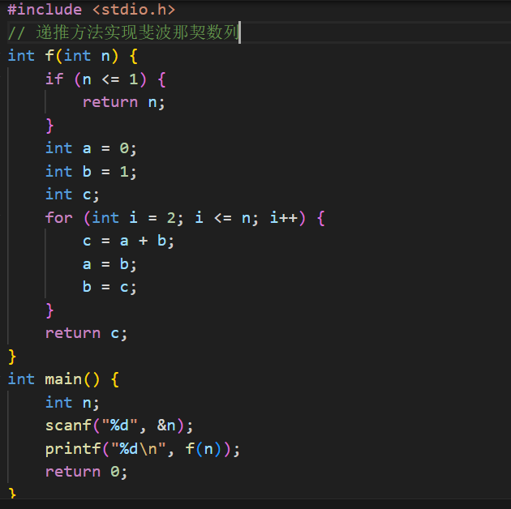

<mark style="background-color：colorName/hexOfColor">C语言内存模型</mark>  
1.栈溢出，顾名思义，就是栈区空间耗尽，将导致无法为新函数调用或局部变量等等分配内存的异常情况，导致程序崩溃或出现未定义行为。  
其有可能是函数内部的数组过大、递归调用层次太多，指针或数组越界等引起  
2.（1）栈区用栈存储，堆区用堆存储  
（2）在申请大小的限制上，栈区是向低地址扩展的数据结构，是一块较为连续的内存的区域；而堆区是地址扩展的数据结构，是不连续的内存区域。  
（3）在申请效率上，栈由系统自动分配，速度较快。但程序员是无法控制的；堆是由new分配的内存，一般速度比较慢，而且容易产生内存碎片,不过用起来最方便.  
3.只读区：  
·程序代码区（code）    
·常量区（constant）  
可读写区：  
·全局数据区 (global data)	
·堆区 (heap)   
·栈区（stack）  
·动态数据库  
<mark style="background-color：colorName/hexOfColor">内存模型的应用</mark>  
•constValue:常量区  
•constString:常量区  
•globalVar:全局数据区  
•staticVar:为静态变量，存储在全局数据区   
•localVar:栈区    
•ptr:栈区  
•localVarMain:栈区  
（还是输入地址轻松一丢丢吧XD）   
  
可以看出常量区的地址在较低的内存区，全局变量区的地址的内存区比常量区较高，栈区的地址比全局变量区的低。  
<mark style="background-color：colorName/hexOfColor">浅谈Cache</mark>  
一.  
1.冯诺伊曼体系结构:  (膜拜冯诺依曼大神qwq)  
顾名思义，是由约翰·冯·诺伊曼在20世纪提出的计算机设计模型，一种将程序指令存储器和数据存储器合并在一起的存储器结构，为现代计算机的基础奠定了理论框架。  
其有存储程序、单一的存储系统、数据与指令的相同处理方式、顺序执行、输入/输出设备等基本特点。  
2.现代计算机的组织结构  (计组？！)
现代计算机的组织结构则是对冯诺伊曼体系结构的扩展和发展，引入了更复杂的硬件和多种功能。  
例如：多级缓存、并行处理、指令集架构（ISA）、虚拟内存、输入/输出管理。  
不同点：
(1).存储与处理方面：冯诺伊曼体系结构强调程序和数据存储在同一内存中，而现代计算机可能使用更复杂的存储架构（如缓存和虚拟内存）  
(2).执行模型方面：冯诺伊曼模型主要基于顺序执行，而现代计算机可以进行并行处理，允许同时处理多个任务。  
(3).硬件复杂度方面：现代计算机的硬件设计比冯诺伊曼模型要复杂得多，包括更多的组件、层次结构和优化技术。  
(4).虚拟化方面：现代计算机支持虚拟内存和虚拟化技术，而冯诺伊曼体系结构并没有考虑这些概念。  
(5).输入输出方面：现代计算机的输入/输出系统更为复杂，支持高速数据传输和多重输入输出设备，而冯诺伊曼模型则相对简单。  
二.  
主存储器的工作分为几个方面：  
读操作  
（1）、CPU向主存储器发送读的指令，并提供地址  
（2）、主存储器将需要读取的数据的地址传递给MAR  
（3）、MAR根据地址去存储体中寻找对应的数据并传递给MDR  
（4）、主存储器从MDR处获取数据并提交给CPU  
  
写操作  
（1）、CPU向主存储器发送写的指令，并指定地址  
（2）、主存储器将需要写入的数据传递给MDR，将地址传递给MAR  
（3）、存储体从MAR获取地址，从MDR获取数据，并按照地址存储数据    
  
存储体：  
存储体 = 地址 + 存储单元  
一个地址对应一个存储单元  
存储单元内存放一串二进制代码，即存储字  
二进制代码的位数代表存储字的长度，即存储字长，单位是比特（bit）  
存储二进制代码的电子元件叫存储元，一个存储元可存储1bit    
  
(先用ai搜了一下，发现有点离谱qwq。然后在csdn找了好久，稍微总结了几篇文章XD，感觉这部分确实很底层捏)  
  
三.Cache的局部性原理指的是将程序中最活跃，运行最频繁的一部分放在cache中去。  
分为空间局部性和时间局部性。  
空间局部性：  
在最近的未来要用到的信息（指令和数据），很可能与现在正在使用的信息在存储空间上是邻近的  
时间局部性：  
在最近的未来要用到的信息，很可能是现在正在使用的信息  
（(艹皿艹)最难理解的一集，不过好像确实能提高程序的运行速度qwq）  
四.因为Cache缩短了CPU的等待时间。  
Cache的功能是提高CPU数据输入输出的速率。Cache容量小但速度快，内存速度较低但容量大，通过优化调度的算法，提高并行性，系统的性能会大大改善，让其减少访问延迟，仿佛存储系统容量与内存相当而访问速度近似Cache。  
（好像还真挺有用的(owo)）  
  
<mark style="background-color：colorName/hexOfColor">代码优化</mark>  
这个拿斐波那契数列最好举例子了qwq:  
斐波那契数列：  
未优化版：  
  
显然，若用递归实现，n足够大时，有可能会爆栈，因为每次递归调用都会占用栈空间。  
而且，每次计算时，都会重复之前运算的结果，导致时间复杂度变大。  
优化版：  
  
用递推实现，避免了递归带来的大开销，不会栈溢出，而且代码较简单  
  
未优化的时间复杂度为O($2^n$)，空间复杂度为O(n)；优化后的时间复杂度为O(n)，空间复杂度为O(1)   
  
显然优化后的代码更优

